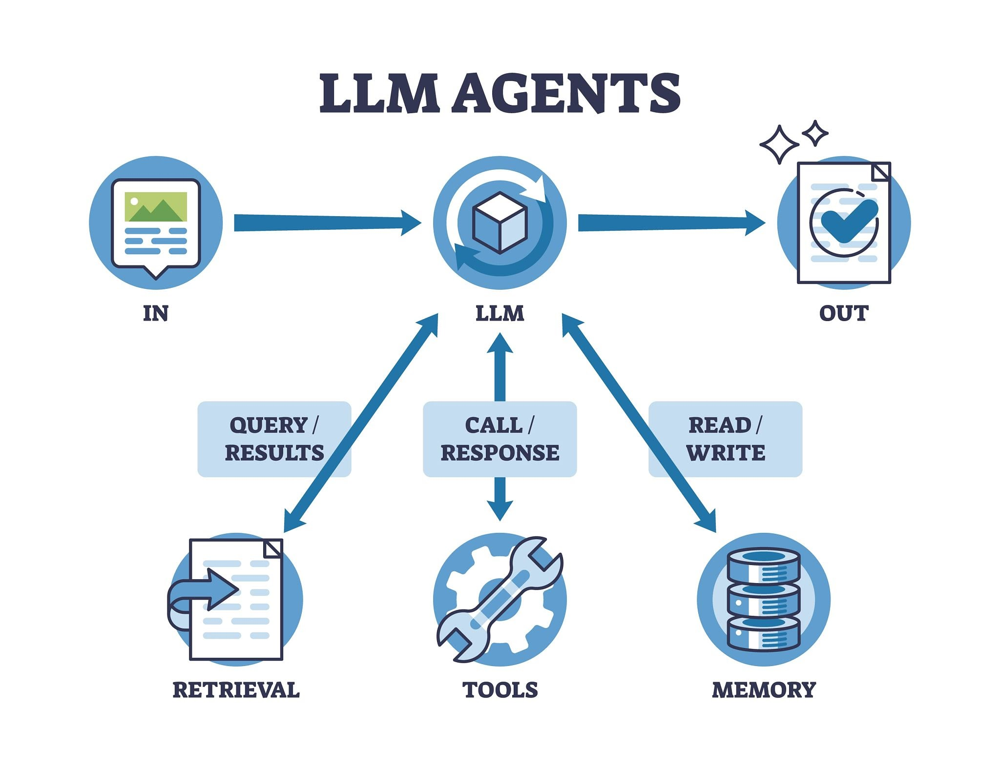
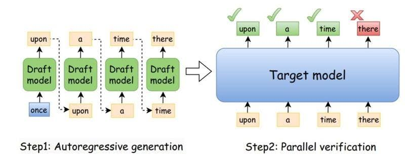

**UCSD – WukLab**
_Advised by [Prof. Yiying Zhang](https://cseweb.ucsd.edu/~yiying/) (UCSD)_


**Authors:** Adyasha Patra, Amrita Moturi, Boqin Yuan, Hongrui Zhu, Yen-Ting Lee, Yogesh Prabhu

**Date:** December 2025

**Research Area:** LLM Systems · Agentic AI · Speculative Decoding · Tool-Calling · Efficient Inference

**Code:** `Patra2020/draft-model-finetuning`

---

## Executive Overview

Large Language Model (LLM) agents rely on external tools (search, code interpreters, APIs) to perform multi-step reasoning. However, traditional execution is strictly sequential: the agent reasons, selects a tool, waits for execution, and continues. In complex agent frameworks like *Co-Sight* or *Open Deep Research*, inference latency accounts for **over 90% of total runtime**.


Credits: VectorMine / Getty Images
### The Core Idea: Speculative Execution for Actions

Inspired by speculative decoding, **Speculative Tool Calling** decouples tool prediction from actor model reasoning:

1. A small, fast **Draft / Speculator Model** predicts the next tool call and executes it early.
2. Simultaneously, the large, accurate **Actor Model** continues its complete reasoning process.
3. If the actor's final decision matches the pre-executed tool call, the precomputed result is reused (**cache hit**), eliminating execution latency. If not, the system falls back to normal execution.


Credits: https://medium.com/@genai.works/speed-up-llm-inference-with-speculative-decoding-1fc79701e9d6

## Central Research Question & Key Findings

> *"Can a small model predict what tool a larger model will call before the larger model has finished reasoning?"*

### Key Insights

* **Fine-Tuning Works in Small Toolsets:** Distilling expert traces (**Gemini 2.5 Pro**) into a small draft model (**Qwen3-4B**) jumped prediction accuracy from **1.9% to 51.9%** in a 4-tool environment.
* **Complexity Drops Performance:** Expanding the environment to 17 tools with semantically overlapping functionality caused accuracy to drop sharply to **31.5%**.
* **Unstable Action vs. Failure to Act:** Fine-tuning shifted the model's main failure mode from *inactivity* to *unstable action* (repetitive loops, argument hallucination, over-action).

---

## Architecture & Dataset Pipeline

### 1. Distillation via Synthetic GAIA Traces

To align the draft model's structure with the expert actor:

* **Source:** Workflows from the **GAIA benchmark** were parsed into structured synthetic traces:
```json
{
  "thought": "...",
  "action": {
    "tool_name": "...",
    "arguments": {}
  }
}

```


* **Dataset Split:** 90 Training, 28 Validation, 27 Test examples.
* **Fine-Tuning:** Applied **LoRA** (Low-Rank Adaptation) on attention projection layers of **Qwen3-4B** using **Teacher Forcing** and **Assistant-Only Loss** (masking user prompts).

---

## Experimental Setup & Toolset Complexity

The draft model was tested across two tool environments to assess sensitivity to action-space ambiguity:

| Feature | Configuration A: Small Curated | Configuration B: Large Comprehensive |
| --- | --- | --- |
| **Tool Count** | 4 tools | 17 tools |
| **Tools Included** | `search`, `wikipedia`, `calculator`, `final_answer` | `search_with_content`, `file_read`, `calculate`, `code_exec`, `finance.get_world_bank_data`, `python`, `web_search`, `wiki.get_page`, etc. |
| **Ambiguity Level** | Low (Distinct tools) | High (Overlapping semantics, e.g., `search` vs `web_search` vs `search_with_content`) |

---

## Key Experimental Results

### 1. Small Toolset Performance (4 Tools)

| Model | Tool Name Accuracy | Improvement |
| --- | --- | --- |
| **Base Qwen3-4B** | 1.9% | Baseline |
| **LoRA Fine-Tuned Qwen3-4B** | **51.9%** | **+50.0%** |

* **LLM-as-a-Judge Outcome:** 37.0% LoRA Wins, 63.0% Ties, 0.0% Base Wins.

### 2. Large Toolset Performance (17 Tools)

| Toolset | Tool Name Accuracy | Performance Shift |
| --- | --- | --- |
| **Small Curated Toolset** | 51.9% | Baseline |
| **Large Comprehensive Toolset** | **31.5%** | **-20.4%** |

* **Qualitative Shift:** LoRA Wins dropped to **11.1%**, while Base Wins rose to **33.3%** because fine-tuning caused the draft model to aggressively make incorrect tool predictions in complex tool spaces.

---

## Primary Failure Modes in Speculative Tool Calling

A correct tool prediction alone is insufficient for a cache hit—the execution requires complete alignment:

```
Successful Speculative Execution Requirements:
Correct Tool + Correct Arguments + Correct Format + Correct Timing + Correct Stopping Behavior

```

1. **Catastrophic Output Loops:** Trapped in infinite sequences of `final_answer → final_answer → ...` without halting.
2. **Tool Mismatch / Substitution:** Predicting `search` when the expert used `search_with_content` (semantically close, but cache miss under exact verification).
3. **Argument Hallucination:** Selecting the correct tool name, but supplying incorrect query parameters.
4. **Generic Tool Collapse:** Defaulting heavily to basic search tools rather than domain-specific functions.

---

## Proposed Future Directions

```
[Full Toolset] ──> [Task-Aware Filtering] ──> [Hierarchical Grouping] ──> [Draft Prediction + Runtime Guardrails]

```

* **Action-Space Regularization:** Dynamically prune irrelevant tools before passing the context to the speculator.
* **Hierarchical Tool Prediction:** Predict in stages: `Action Category` → `Tool Family` → `Specific Tool` → `Arguments`.
* **Semantic Tool Grouping:** Group tools into distinct families (Search, Vision, Wikipedia) to avoid fine-grained confusion.
* **Supervised Stopping Criteria:** Train explicit stop tokens or action budgets to avoid generation loops.
* **Runtime Guardrails:** Terminate speculation early if repetitive tool calls exceed set thresholds.

---

## Stack & Technologies

* **Core Models:** Gemini 2.5 Pro (Expert Actor), Qwen3-4B (Speculator)
* **Frameworks & Techniques:** PyTorch, Hugging Face Transformers, PEFT / LoRA, Teacher Forcing
* **Benchmark:** GAIA Benchmark

<!--
    <!-- ---
    layout: page
    title: project
    description: a project with a background image
    img: /assets/img/12.jpg
    ---

<div class="row">
    <div class="col-sm mt-3 mt-md-0">
        
    </div>
    <div class="col-sm mt-3 mt-md-0">
        
    </div>
    <div class="col-sm mt-3 mt-md-0">
        
    </div>
</div>
<div class="caption">
    Caption photos easily. On the left, a road goes through a tunnel. Middle, leaves artistically fall in a hipster photoshoot. Right, in another hipster photoshoot, a lumberjack grasps a handful of pine needles.
</div>
<div class="row">
    <div class="col-sm mt-3 mt-md-0">
        
    </div>
</div>
<div class="caption">
    This image can also have a caption. It's like magic.
</div>

You can also put regular text between your rows of images.
Say you wanted to write a little bit about your project before you posted the rest of the images.
You describe how you toiled, sweated, _bled_ for your project, and then... you reveal its glory in the next row of images.

<div class="row justify-content-sm-center">
    <div class="col-sm-8 mt-3 mt-md-0">
        
    </div>
    <div class="col-sm-4 mt-3 mt-md-0">
        
    </div>
</div>
<div class="caption">
    You can also have artistically styled 2/3 + 1/3 images, like these.
</div>

The code is simple.
Just wrap your images with `<div class="col-sm">` and place them inside `<div class="row">` (read more about the <a href="https://getbootstrap.com/docs/4.4/layout/grid/">Bootstrap Grid</a> system).
To make images responsive, add `img-fluid` class to each; for rounded corners and shadows use `rounded` and `z-depth-1` classes.
Here's the code for the last row of images above:



```html
<div class="row justify-content-sm-center">
  <div class="col-sm-8 mt-3 mt-md-0">
    
  </div>
  <div class="col-sm-4 mt-3 mt-md-0">
    
  </div>
</div>
<!-- ``` --> 

<!--  -->
